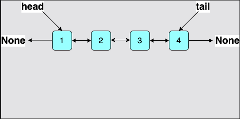

## Which is Better?
DLLs have a few advantages over SLLs, but these perks do not come without a cost:

- Doubly linked lists can be traversed in both directions, which makes them more compatible with complex algorithms.
- Nodes in doubly linked lists require extra memory to store the previous_element pointer.
- Deletion is more efficient in doubly linked lists as we do not need to keep track of the previous node. 
  We already have a backwards pointer for it.

At this point, we’ve compared the two major types of linked lists. 
The minor memory load that comes with DLLs can be forgone because of the convenience they provide.
This does not mean that DLLs are perfect. There is always room for improvement!
Let’s discuss a tweak which can improve the functionality of both types.

## Tail Pointer in a Linked List
The `head` node is essential for any linked list, 
but what if we also kept account of the tail of the list? 
Now, you are aware of both ends of a linked list.

Apart from tail operations, insertion and deletion become twice as fast because we can traverse the list from both sides.

Here is an illustration of the modified doubly linked list
> 

The `tail` updates every time a new node is added at the end or a node is deleted from the end. 
The good news is that these operations are just as fast as `delete_at_head` and `insert_at_head`.

