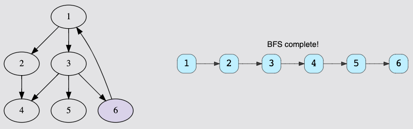
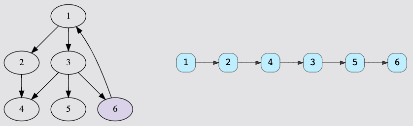

## Time Complexities
Below, you can find the time complexities for the 4 basic graph functions.

Note that, in this table, V means the total number of vertices and E means 
the total number of edges in the Graph.

| Operation                  | Adjacency List | Adjacency Matrix |
|----------------------------|----------------|------------------|
| Add Vertex                 | O(1)           | O(V^2)           |
| Add Edge                   | O(1)           | O(1)             |
| Remove Vertex              | O(V + E)       | O(V^2)           |
| Remove Edge                | O(E)           | O(1)             |
| Query (Edge Exists)        | O(V)           | O(1)             |
| Space Complexity           | O(V + E)       | O(V^2)           |
| Breadth First Search (BFS) | O(V + E)       | O(V^2)           |
| Depth First Search (DFS)   | O(V + E)       | O(V^2)           |

## Adjacency List
- Adding an edge in adjacency lists takes constant time as we only need to insert at the head node of the corresponding vertex.

- Removing an edge takes O(E) time because, in the worst case, all the edges could be at a single vertex and hence, we would have to traverse all E edges to reach the last one.

- Removing a vertex takes O(V + E) time because we have to delete all its edges and then reindex the rest of the list one step back in order to fill the deleted spot.

- Searching an edge between a pair of vertices can take up to O(V) if all V nodes are present at a certain index and we have to traverse them.

## Adjacency Matrix
- Edge operations are performed in constant time as we only need to manipulate the value in the particular cell.

- Vertex operations are performed in O(V2) since we need to add rows and columns. We will also need to fill all the new cells.

- Searching an edge is O(1) because we can access each edge by indexing.

## Traversal
Any traversal needs a starting point, but a graph does not have a linear structure like lists or stacks.
So how do we give graph traversal a better sense of direction?
This is where the concept of levels is introduced. Take any vertex as the starting point. 
This is the lowest level in your search. 
The next level consists of all the vertices adjacent to the starting vertex. 
A level higher would mean the vertices adjacent to the nodes at the lower level.

1. Breadth first search
    > 
   
    The BFS algorithm earns its name because it grows breadth-wise. All the nodes at a certain level are traversed before moving on to the next level.
The level-wise expansion ensures that for any starting vertex, you can reach all others, one level at a time.
   
2. Depth first traversal
   > 
   
    Starting from any node, we keep moving to an adjacent node until we reach the farthest level. Then we move back to the starting point and pick another adjacent node. Once again, we probe to the farthest level and move back. This process continues until all nodes are visited.

