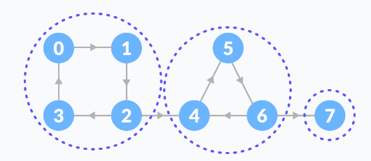

## Undirected Graph
An undirected graph is a graph in which the edges do not point in any direction (ie. the edges are bidirectional).

## Connected Graph
A connected graph is a graph in which there is always a path from a vertex to any other vertex.

## Spanning Tree
A spanning tree is a sub-graph of an undirected connected graph, which includes all the vertices of the graph with a minimum possible number of edges. If a vertex is missed, then it is not a spanning tree.

## Minimum Spanning Tree
A minimum spanning tree is a spanning tree in which the sum of the weight of the edges is as minimum as possible.

## The minimum spanning tree from a graph is found using the following algorithms:
- Prim's Algorithm
- Kruskal's Algorithm

## Spanning Tree Applications
- Computer Network Routing Protocol
- Cluster Analysis
- Civil Network Planning

## Minimum Spanning Tree Application
- To find paths in the map.
- To design networks like telecommunication networks, water supply networks, and electrical grids.

## Strongly Connected Components
A strongly connected component is the portion of a directed graph in which there is a path from each vertex to another vertex.
**It is applicable only on a directed graph**.

These components can be found using Kosaraju's Algorithm.

## Kosaraju's Algorithm Time Complexity
Kosaraju's algorithm runs in linear time i.e. `O(V+E)`.

